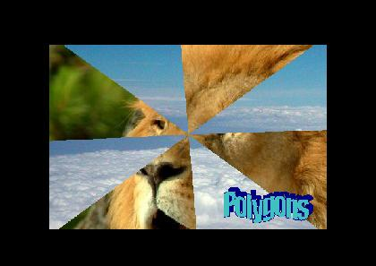



## Polygon Pictures v\.2

### Description

Using multiple polygons to create a "fan effect" type slide show. Zip ~ 360K
 
### More Info
 

             |
---                |---
**Submitted On**   |2007-08-06 08:04:50
**By**             |[Chris  Seelbach](https://github.com/Planet-Source-Code/PSCIndex/blob/master/ByAuthor/chris-seelbach.md)
**Level**          |Intermediate
**User Rating**    |5.0 (10 globes from 2 users)
**Compatibility**  |VB 6\.0
**Category**       |[Graphics](https://github.com/Planet-Source-Code/PSCIndex/blob/master/ByCategory/graphics__1-46.md)
**World**          |[Visual Basic](https://github.com/Planet-Source-Code/PSCIndex/blob/master/ByWorld/visual-basic.md)
**Archive File**   |[Polygon\_Pi207860872007\.zip](https://github.com/Planet-Source-Code/chris-seelbach-polygon-pictures-v-2__1-69112/archive/master.zip)

